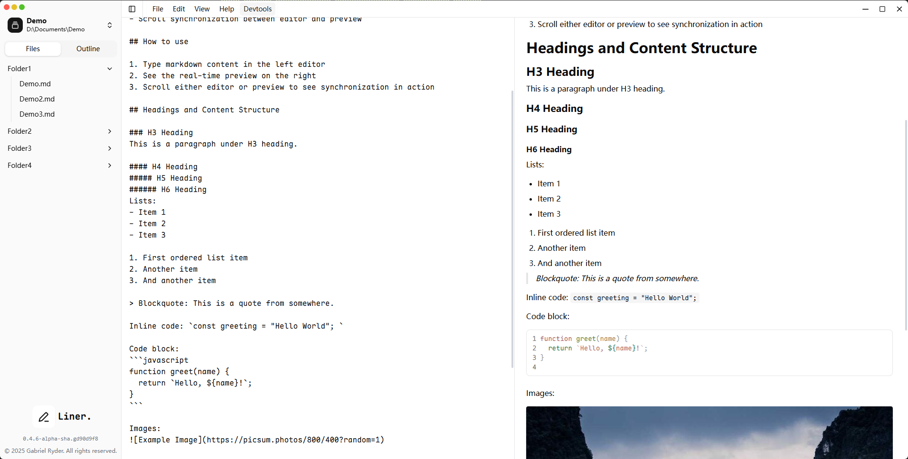

# Liner
Liner is a Open-Source, user-friendly and local markdown editor.

## Tips
At present, it is a fast iteration stage, which does not guarantee the perfection and applicability of the function. We do not provide the build version for the time being. We welcome to participate in the development and contribution.

The emergence of Liner, in order to replace Typora, will plan to provide all Typora functions and more personalized functions. 

## Development
Liner is built with Tauri 2, Vue 3 and TypeScript.

development environment:
- Rust latest
- Node latest Lts
- Pnpm latest

You can follow the steps below:
1. Install Rust 
2. Clone the repository
3. Install the dependencies
4. Build the project
5. Run the project

## License
Liner is open-source software licensed under the GPLv3 License.

